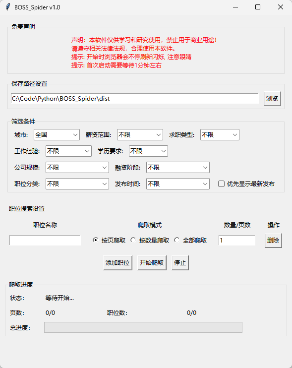
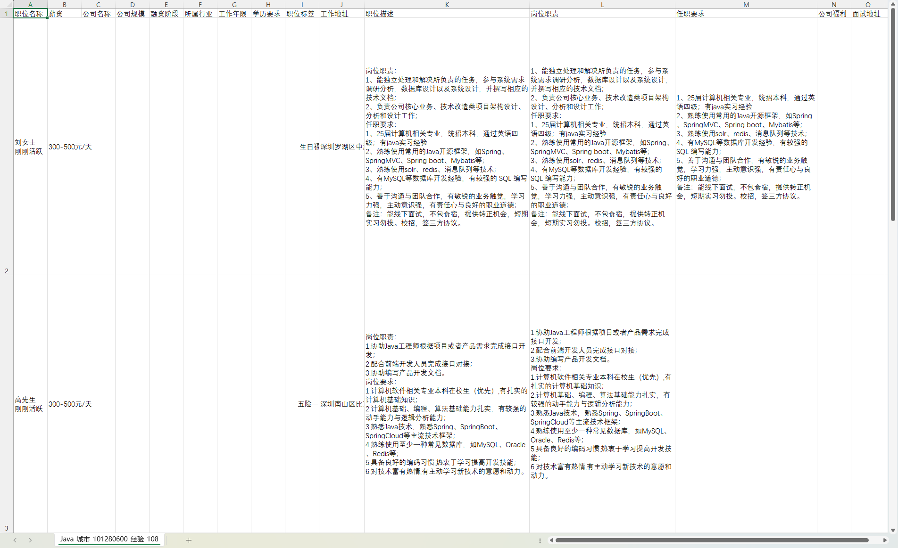
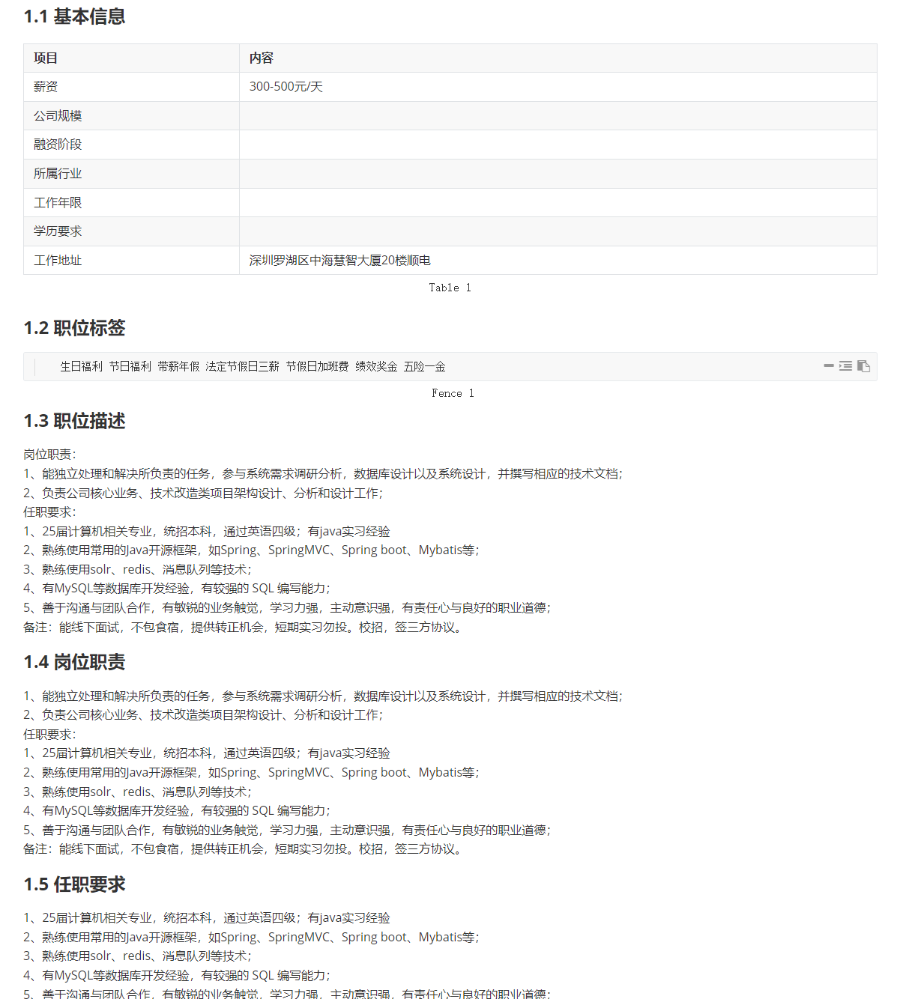

# BOSS_Spider 职位信息爬虫工具

## 项目介绍

BOSS_Spider 是一个模拟人工的爬虫工具，专门用于爬取BOSS直聘网站的职位信息。

> **声明**：本软件仅供学习和研究使用，禁止用于商业用途。请遵守相关法律法规，合理使用本软件。


## 主要功能

- **多种爬取模式**：支持按页爬取、按数量爬取和全部爬取三种模式
- **多职位批量爬取**：可同时设置多个职位进行批量爬取
- **灵活的保存设置**：自定义设置爬取结果的保存位置
- **实时进度显示**：直观展示爬取过程和进度
- **多格式保存**：自动将爬取结果保存为CSV和Markdown两种格式
- **结果快速访问**：提供直接打开CSV、Markdown文件和保存文件夹的快捷按钮


## 安装说明

### 环境要求

- Python 3.6 或更高版本
- Google Chrome 浏览器
- Windows/MacOS/Linux 操作系统

### 安装步骤

1. 克隆或下载本仓库到本地

```bash
git clone https://github.com/your-username/BOSS_Spider.git
cd BOSS_Spider
```

2. 安装所需依赖包

```bash
pip install -r requirements.txt
```

### Chrome WebDriver 说明

本程序使用 `webdriver-manager` 自动管理 Chrome WebDriver，会根据您的浏览器版本自动下载匹配的 WebDriver，无需手动安装。


## 使用方法

+ 运行主程序

```bash
python main.py
```

- 直接下载打包好的EXE
  - [蓝奏云](https://wwzk.lanzouo.com/ii4Eo2ovuvaj) 密码:8otq
  - [Github Releases](https://github.com/HanHai-Space/BOSS_Spider/releases/download/BOSS_Spider/BOSS_Spider.exe)


## 软件截图

### 截图（UI丑了点）



### 使用


### csv格式



### md格式




### 配合AI（如Google的NoteBookLM）


## 爬取结果说明

爬取的职位信息将保存为两种格式：

- **CSV文件**：包含所有职位的详细信息，适合数据分析和处理
- **Markdown文件**：格式化的职位信息，方便阅读和分享

每个职位信息包含以下字段：

- 职位名称、薪资、公司名称
- 公司规模、融资阶段、所属行业
- 工作年限、学历要求、职位标签
- 工作地址、职位描述
- 岗位职责、任职要求
- 公司福利、面试地址


## 注意事项

- 首次运行时，程序会自动下载Chrome WebDriver
- 爬取过程中浏览器窗口会刷新，请保持网络连接稳定
- 筛选条件会反映在保存文件名中，方便区分不同筛选结果
- 爬取时可能会遇到反爬机制，请合理设置爬取速度和数量


## 常见问题解决

1. **文件显示问题**：如果界面显示"CSV文件已创建但没有数据"，请直接查看保存目录，实际文件可能已成功创建，只是文件名包含了筛选条件

2. **浏览器启动失败**：确保已安装Google Chrome浏览器，且版本较新

3. **数据保存失败**：检查保存路径是否有写入权限，尝试使用管理员权限运行程序


## 许可证

本项目采用 MIT 许可证 - 查看 [LICENSE](LICENSE) 文件了解详情。
